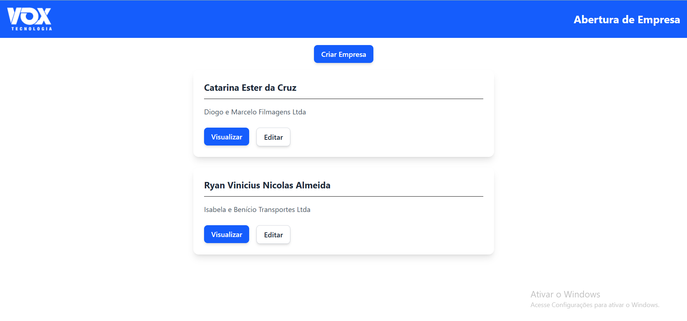
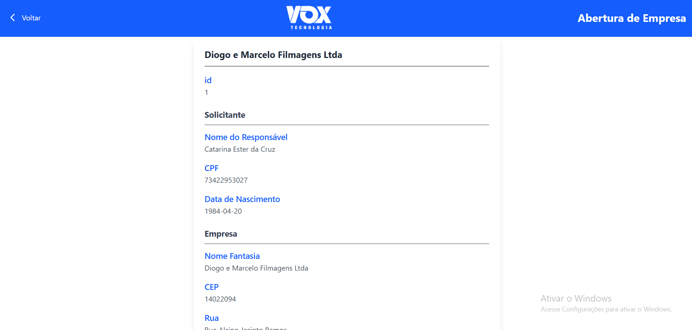
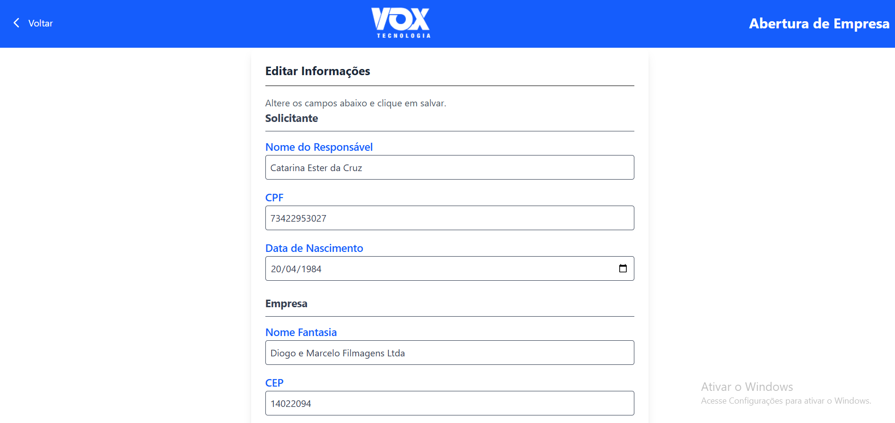
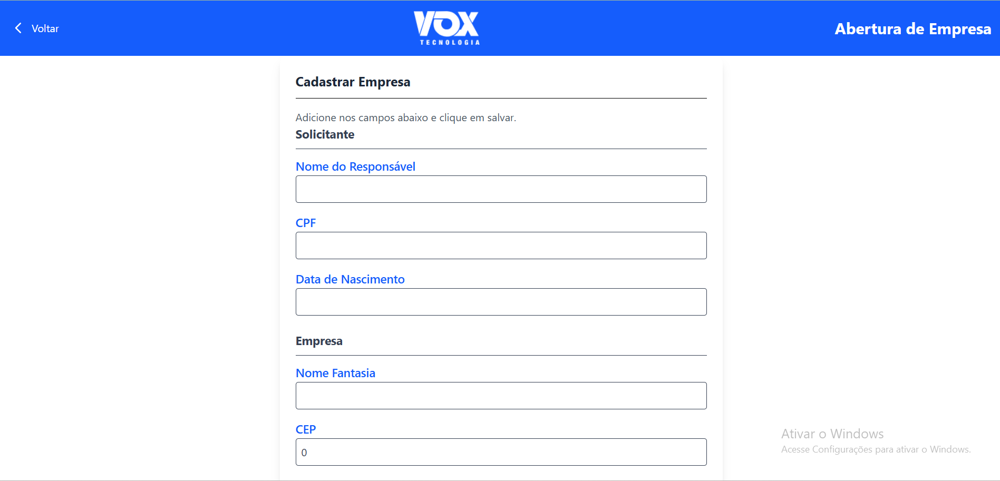

# Abertura de Empresas Vox

Este repositório têm como objetivo alocar a resolução do [desafio](./CHALLENGE.md) proposto pela **_Vox_** para a vaga de desenvolvedor front-end sênior. Neste desafio, é necessário construir uma aplicação para o gerenciamento de empresas.

## Sumário

1. [Descrição](#descrição)
2. [Estrutura dos Dados (JSON)](#estrutura-dos-dados-json)
3. [Visuais](#visuais)
4. [Ferramentas de Desenvolvimento](#ferramentas-de-desenvolvimento)
5. [Requisitos para Instalação](#requisitos-para-instalação)
6. [Instalação](#instalação)
7. [Estrutura do Projeto](#estrutura-do-projeto)
8. [Uso](#uso)
9. [Apoiar](#apoiar)
10. [Autores e Agradecimentos](#autores-e-agradecimentos)
11. [Licença](#licença)
12. [Status do Projeto](#status-do-projeto)

## Descrição

Este projeto tem como principais funcionalidades:

- Listagem de empresas já cadastradas
- Visualização dos detalhes de uma empresa cadastrada
- Edição de uma empresa cadastrada

O cadastro de empresas possui as seguintes atribuições:

1. **Solicitante:**

   - Nome do responsável (`responsibleName`)
   - CPF (`cpfNumber`)
   - Data de nascimento (`birthDate`)

2. **Empresa:**
   - Nome fantasia (`tradeName`)
   - **Endereço:**
     - CEP (`zipCode`)
     - Rua (`street`)
     - Número (`number`)
     - Complemento (`complement`)
     - Bairro (`neighborhood`)
     - Cidade (`city`)
     - Estado (`state`)

## Estrutura dos Dados (JSON)

Exemplo de estrutura para cadastro de uma empresa:

```json
{
  "id": "1",
  "applicant": {
    "responsibleName": "Catarina Ester da Cruz",
    "cpfNumber": "73422953027",
    "birthDate": "1984-04-20"
  },
  "company": {
    "tradeName": "Diogo e Marcelo Filmagens Ltda",
    "address": {
      "zipCode": 14022094,
      "street": "Rua Alcino Jacinto Ramos",
      "number": "233",
      "complement": null,
      "neighborhood": "Quinta da Primavera",
      "city": "Ribeirão Preto",
      "state": "SP"
    }
  }
}
```

## Visuais

Temos algumas **demonstrações**, exemplificando a utilização da **Abertura de Empresas**.
Você pode visualizá-los a seguir:

### Listagem de Empresas



### Detalhes da Empresa



### Edição da Empresa



### Criação de Nova Empresa



## Ferramentas de Desenvolvimento

Para este projeto recomendamos a utilização das seguintes ferramentas:

- [Visual Studio Code](https://code.visualstudio.com/download)

## Requisitos para Instalação

Para executar o projeto em ambientes como _browsers_ e _devices_, será necessário que você tenha:

- [_Git_](https://git-scm.com/downloads): Para clonar projeto e versionar as features e hotfixes.
- [_Node_ - v22.14.0](https://nodejs.org/download/release/v22.14./0): Usado como ambiente de execução de aplicações JavaScript.
- [_Angular CLI_ - 19.2.4](https://v19.angular.io/cli): Usado para executar os comandos necessários para executar o buidar o projeto, lint, entre outras ferramentas disponíveis.

## Instalação

1. Clone o repositório: `git clone https://github.com/GAMELEIRA/challenge-vox-business-opening`.

2. Abra o terminal e posicione na raiz do projeto, e instale as dependencias executando: `npm install`.

Se não houver erros, você pode fazer [uso](#uso) do projeto.

## Estrutura do Projeto

Este projeto segue os princípios estabelecidos pela comunidade do Angular e foi estruturado de acordo com as [melhores práticas](https://dev.to/digitaldino/series/22633), organizando de maneira clara os componentes compartilhados e específicos, bem como os módulos correspondentes, organizando em modulos core, feature e shared.

**Arquitetura do Projeto**

O projeto está organizado da seguinte forma para garantir modularidade e facilidade de manutenção:

- `src/app/`
  `/core`
  `/feature`
  `/shared`

- `src/`
  `/assets`

A seguir uma breve explicação de cada diretório.

- **_Feature_**: Cada módulo de funcionalidade, ou seja, cada recurso da aplicação que nos comprometemos a entregar. Cada modulo dentro do feature contém seus próprios componentes, serviços e outras lógicas específicas que não são necessárias compartilhar com outros módulos.

- **_Shared_**: Contém componentes, modelos, serviços e pipes que são compartilhados entre diferentes componentes da aplicação. Esse talvez seja o diretório mais importante para a coesão do app. Antes de criarmos qualquer coisa devemos pensar:

  1. Será que esse serviço, modelo, componente já existe?
  2. O que eu vou criar pode ser compartilhado entre outros módulos?

Pensando nessas perguntas você sempre irá olhar para este módulo.

- **_Assets_**: Contém tudo que é relacionado a multi midía, e arquivos de tradução para português.

## Uso

**Para executar o projeto em página de algum navegador:**

1. Abra o terminal na raiz do projeto e execute algum desses comandos para executar a aplicação:

- `npm run start-server`: Para rodar o **_Json Server Api_**.

E em seguida

- `ng serve` ou `npm start`: Para subir a aplicação **_Angular_**.

2. Após a execução desses comandos, aplicação estará disponível para acesso através de um navegador utilizando uma URL `http://localhost:4200/companies`. Para acesso da API fake `http://localhost:3000/companies`.

## Apoiar

Estou sempre aberto a melhorias e sugestões. Se você tiver alguma ideia ou _feedback_, por favor, entre em contato comigo pelas minhas redes sociais.

<div align="center">
<a href="https://www.linkedin.com/in/gabriel-gameleira-dos-santos-634b23161/" style="color: #FFFFFF;
    text-decoration: none;">
    
</a>
<a href="mailto:gameleira270499@gmail.com" style="color: #FFFFFF;text-decoration: none;">
    
</a>
</div>

## Autores e Agradecimentos

Agradeço a **_Vox_** por propor a resolução do desafio que gerou nesse importante projeto.

## Licença

[MIT](./LICENSE)

## Status do Projeto

O projeto está **ativo** e em constante **desenvolvimento**!

Próximas melhorias: 
- Adição de testes unitários
- Adição de testes e2e
- Adição da funcionalidade de exclusão
- Adição de modais/toasts para exibição de respostas aos usuários
- Adição de mecanismo de login

Me [apoie](#apoiar) nessa jornada!
